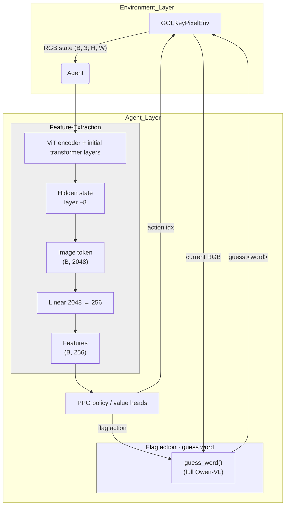

# GOL-Target: Visually‑Grounded RL in an Interactive Cellular Automaton

A research playground that combines Conway’s Game of Life–style dynamics with typed‑character actions, vision‑language models (VLMs), and reinforcement learning (RL).  An agent must type letters that **grow edge‑connected prefixes** of a hidden target string on the board, then raise a flag to guess the full word.

<p align="center">
  
  <br>
  <em>gameplay recording captured via <code>gol_key_viewer.py</code></em>
</p>

---

## Table of Contents

1. [Project Structure](#project-structure)
2. [Quick Start](#quick-start)
3. [Architecture](#architecture)
4. [Next Steps](#next-steps)
5. [Citation & License](#citation--license)

---

## Project Structure

| Path                    | Purpose                                                          |
| ----------------------- | ---------------------------------------------------------------- |
| gol_key_env.py        | Core environment (Gymnasium) and renderer                        |
| word_env.py           | Curriculum wrapper that samples target words of variable length  |
| agent_model.py        | **Qwen‑2.5‑VL‑3B** feature extractor + guessing helper           |
| train.py              | PPO training harness (Stable‑Baselines3)                         |
| callbacks.py          | Curriculum and success‑rate callbacks                            |
| gol_key_viewer.py     | Pygame viewer for manual play & demo recording                   |
| prepare_word_lists.py | Builds train_words.txt / test_words.txt using Zipf filtering |
| stage_gpu_cfg.py      | Example config override for multi‑GPU runs                       |
| docs/                 | Supplementary figures, demo video, extra notebooks               |

---

## Quick Start
1. **Navigate to persistent storage**

   ```zsh
   cd fresh_cloud_dir
   ```
   
2. **Clone the repo**

   ```zsh
   git clone https://github.com/Kalen6k/gol_key.git \
   cd gol_key
   ```
   
3. **Create and activate a virtual environment**

   ```zsh
   python -m venv venv
   source venv/bin/activate
   ```
   
4. **Install dependencies into the venv**

   ```zsh
   pip install stable-baselines3 wandb gymnasium pillow transformers accelerate xformers huggingface_hub wordfreq torch num2words numba tensorboard flash_attn
   ```

5. **Prepare word lists**
   
   ```zsh
   python prepare_word_lists.py
   ```

6. **Run training (adjust internal batch size in train.py if OOM, this runs (albeit slowly) on an A100)**
   
  ```zsh
  python train.py --config stage_gpu_cfg.py
  ```

---

## Architecture




**Feature Extraction Pipeline:**

1.  A batch of RGB image states from the environment is passed to the VLMExtractor.
2.  The Qwen2.5-VL-3B model performs a forward pass (Vision Transformer + Main LLM Transformer blocks). See Refs [2, 3, 4].
3.  The hidden states from an intermediate layer (currently layer -8, index 28 out of 36) are retrieved. The choice of an intermediate layer is inspired by findings suggesting they may hold more general features than final layers for certain models and downstream tasks [1].
4.  From this layer's output (Batch, SeqLen, 2048), the specific hidden state vector corresponding to the special image_token_id or vision_token_id is extracted for each image in the batch, resulting in a tensor of shape (Batch, 2048).
5.  This (Batch, 2048) tensor is projected down to (Batch, 256) using a linear layer (cls_proj).
6.  These 256-dimensional features are fed into the PPO Policy and Value networks (MLP heads defined in train.py).

**Guessing:**

* When the PPO policy outputs the "flag" action, the GOLKeyPixelEnv calls the agent_model.guess_word() method. This method takes the *current single* RGB observation, formats a specific prompt, performs a separate forward pass through the Qwen2.5-VL model to generate text, and parses the output to extract the guessed word.

---

## Next Steps

| Task                                                                                                                                                                                                           |
| :------------------------------------------------------------------------------------------------------------------------------------------------------------------------------------------------------------- |
| Implement **benchmark adapters** for external vision‑LLM APIs (OpenAI, Gemini, Claude). Each adapter will accept an RGB frame and emit one keypress at a time, plus a final guess:<word> when confident. No training or embedding access required — purely zero‑shot evaluation. |
| Add more sophisticated RL techniques, pass more frames as state, ...|
| Experiment with different VLM backbones or feature extraction layers/methods.|
| Add a LR scheduler.|
| Perform systematic evaluation of agent performance vs word length, grid size, etc.|

---

### Viewer quick-runs

1. **Random agent**

   ```zsh
   python gol_key_viewer.py --agent random
2. **Target hidden**

   ```zsh
   python gol_key_viewer.py competitive
3. **Target hidden, length given**

   ```zsh
   python gol_key_viewer.py competitive-lg
4. **Target hidden, length given, prefix progress**

   ```zsh
   python gol_key_viewer.py competitive-lg-prefix
5. **default: user-driven input with full information**

   ```zsh
   python gol_key_viewer.py

---

## References

1.  D. Bolya, P. Huang, P. Sun, et al., "Perception Encoder: The best visual embeddings are not at the output of the network," *arXiv:2504.13181*, 2025. [[arXiv Link](https://arxiv.org/abs/2504.13181)]
2.  Qwen Team, Alibaba Group, "Qwen2.5-VL Technical Report," *arXiv:2502.13923*, 2025. [[arXiv Link](https://arxiv.org/abs/2502.13923)]
3.  P. Wang, S. Bai, S. Tan, et al., "Qwen2-VL: Enhancing Vision-Language Model's Perception of the World at Any Resolution," *arXiv:2409.12191*, 2024. [[arXiv Link](https://arxiv.org/abs/2409.12191)]
4.  J. Bai, S. Bai, S. Yang, et al., "Qwen-VL: A Versatile Vision-Language Model for Understanding, Localization, Text Reading, and Beyond," *arXiv:2308.12966*, 2023. [[arXiv Link](https://arxiv.org/abs/2308.12966)]
5.  A. Dosovitskiy, L. Beyer, A. Kolesnikov, et al., "An Image is Worth 16x16 Words: Transformers for Image Recognition at Scale," *arXiv:2010.11929*, 2021. [[arXiv Link](https://arxiv.org/abs/2010.11929)]
6.  Hugging Face Transformers Documentation for Qwen2.5-VL: [[HF Docs Link](https://huggingface.co/docs/transformers/en/model_doc/qwen2_5_vl)]

---

## Citation & License

@misc{sixkiller2025golkey,
  title  = {GOL‑Target: Visually‑Grounded Reinforcement Learning for Hidden Pattern Discovery},
  author = {Kalen Sixkiller},
  year   = {2025},
  note   = {\url{https://github.com/kalen6k/gol_target}}
}


Code is released under the MIT License; see LICENSE for detail
